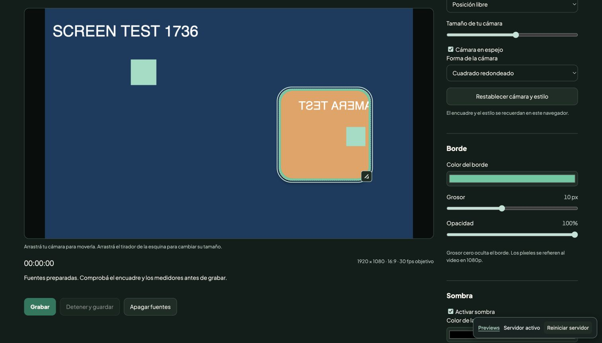

# Local Take

Grabá pantalla, cámara y audio en un solo video, con un editor de cámara en vivo. Todo se procesa en el navegador y se guarda en tu equipo.

Para demos, tutoriales y videos reacción. Sin cuentas, servicios de grabación ni uploads.



## Qué podés hacer

- Elegir una pantalla, ventana o pestaña con el selector del navegador.
- Grabar horizontal en 1080p o 720p, sin deformar ni recortar la fuente.
- Mezclar micrófono con el audio que comparta la fuente; comprobar ambos medidores.
- Mover la cámara arrastrándola y cambiar su tamaño desde el tirador.
- Personalizar borde, sombra, espejo y forma circular o cuadrada redondeada, incluso mientras grabás.
- Recordar el estilo en este navegador y restablecerlo cuando quieras.
- Abrir un archivo local de video en una pestaña para grabar una reacción.
- Guardar un WebM local, con escritura a archivo cuando el navegador ofrece esa función.

## Empezar

Requiere Node.js 20.19.x, 22.13+ o 24+ y un navegador de escritorio con `getDisplayMedia` y `MediaRecorder`. Chrome de escritorio es el entorno recomendado y probado; las fuentes de audio disponibles dependen del navegador, sistema operativo y permisos.

```bash
git clone https://github.com/MatiasJRB/local-take.git
cd local-take
npm ci
npm run dev
```

Abrí la URL que muestra Vite, normalmente `http://127.0.0.1:5173`.

1. **Elegir pantalla, ventana o pestaña.** Para un video reacción, compartí la pestaña del video con audio. El reproductor local permite abrir un archivo sin subirlo.
2. **Preparar cámara y micrófono.** Elegí tus dispositivos; desactivá las fuentes que no quieras.
3. Arrastrá la cámara y su tirador. Ajustá borde y sombra. Flechas mueven la cámara; flechas sobre el tirador cambian el tamaño; Shift acelera el ajuste.
4. Comprobá ambos medidores con auriculares. Grabá una toma corta antes de una sesión larga.
5. **Grabar**, elegir un archivo si se ofrece el selector y, al terminar, **Detener y guardar**. Revisá la toma.

## Privacidad

La aplicación no envía las capturas, voz o videos a un servidor. No incluye analytics, cuentas, telemetría ni integraciones externas. Fuentes, composición y grabación se procesan en el navegador. Las preferencias de encuadre y estilo se guardan en `localStorage`; los permisos de captura y dispositivos los administra el navegador.

El servidor de desarrollo escucha en la interfaz local. El repositorio ignora grabaciones, `.env` y resultados de tests. La imagen de demostración y los tests usan fuentes sintéticas.

## Límites conocidos

- El audio de pantalla o ventana no está disponible en todos los sistemas. Compartir una pestaña con audio suele ser la opción más directa para una reacción; la UI avisa si no llega una pista de audio.
- La salida es **WebM**, no MP4. VP9/Opus si está soportado; VP8 como alternativa.
- El archivo elegido se finaliza al detener la grabación. Un cierre, crash o suspensión antes de ese paso puede hacer perder la toma en curso.
- Si no hay selector de archivo compatible, el video queda en memoria hasta descargarlo. Este modo consume memoria proporcional a la duración.
- La composición usa canvas y un timer para continuar al cambiar de foco. No hay garantía de rendimiento o continuidad durante horas, bajo suspensión ni en cualquier navegador. No se debe usar el resultado de tests con fuentes sintéticas como prueba de captura real.
- La cámara se mantiene dentro del encuadre, pero borde y sombra pueden quedar parcialmente fuera al acercarse a un extremo.
- DRM o contenido protegido pueden impedir capturar un video. La aplicación respeta las restricciones del navegador.

## Desarrollo y checks

```bash
npm run lint
npm test
npm run build
npx playwright install chromium
npm run test:e2e
```

`npm run check` ejecuta todos los checks. El proyecto usa JavaScript nativo y Vite: el build genera archivos estáticos en `dist/`. `npm run preview` sirve ese build localmente. No requiere backend. Para servirlo en otro entorno, el origen debe ser seguro (HTTPS, o localhost); no basta con abrir `index.html` con `file://`.

Los tests unitarios cubren geometría, opacidad y finalización de grabaciones. Los E2E prueban grabación de pantalla/cámara y edición con fuentes sintéticas, sin acceder a hardware real. El test específico de mezcla y señal de audio corre en Linux CI: se omite explícitamente en macOS porque el navegador aislado de tests no hace avanzar el reloj Web Audio en ese entorno. La captura real con audio debe verificarse manualmente con las fuentes y permisos que se van a usar. Esta diferencia no se oculta detrás de un test de audio simulado.

## Estructura

| Archivo                | Función                                     |
| ---------------------- | ------------------------------------------- |
| `src/studio.js`        | Fuentes, audio, canvas y flujo de grabación |
| `src/camera-editor.js` | Arrastre, tamaño, controles y preferencias  |
| `src/core.js`          | Geometría y escritura de la toma            |
| `src/player.js`        | Reproductor de archivo local                |
| `tests/unit/`          | Casos de lógica y regresión                 |
| `tests/e2e/`           | Flujos con fuentes sintéticas               |

## Contribuir

Leé [CONTRIBUTING.md](CONTRIBUTING.md). Los cambios se pueden proponer por issue o pull request. [ROADMAP.md](ROADMAP.md) reúne mejoras candidatas; no son compromisos de entrega.

## Licencia

Código bajo [MIT](LICENSE). Plus Jakarta Sans conserva su [SIL Open Font License 1.1](public/fonts/OFL.txt), con los créditos en [THIRD_PARTY_NOTICES.md](THIRD_PARTY_NOTICES.md).
